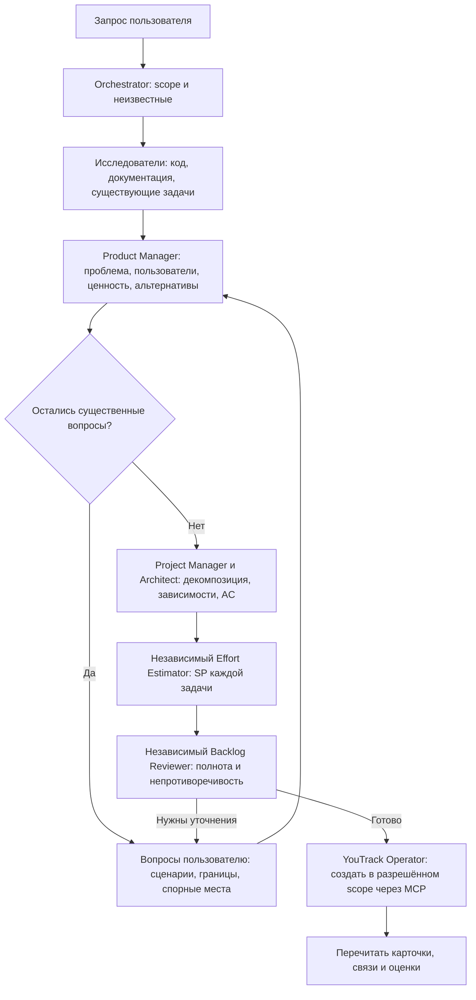
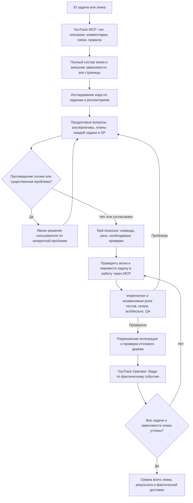
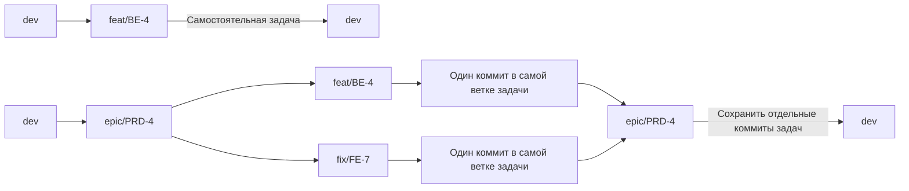

# YouTrack: план изменений и работа агентов

Версия bundle: 8.0.0. Источник задач — https://youtrack.wget-cloud.ru, доступ только через MCP. GitHub остаётся для репозиториев, PR и CI.

## План реализации в плагине

Исследование подтвердило проекты PRD, BE, FE, SITE, WGET, FL, K8S и разные Stage для продуктовых и технических карточек. Скилы перечитывают schemas и правила при работе: snapshot не заменяет актуальные данные сервера. Повторная проверка MCP подтвердила поле Story Points типа integer во всех семи проектах: оценка записывается в поле, обоснование — в описание. Создание административного поля — отдельная операция.

## Создание задачи или эпика

Для эпика исследуется каждый затронутый проект; каждая задача получает собственные сценарии, acceptance criteria, план, зависимости, оценку и открытые вопросы. Интервью проходит несколькими осмысленными раундами. Альтернативы сравниваются по продуктовой ценности, сложности, ограничениям и рискам. Агент предлагает более подходящее решение, если исследование выявило его, даже когда исходный запрос его не упоминал.

SP: 1, 2, 3, 5, 8, 13; выше 13 — предложение декомпозиции. Неизвестность явно обозначается; оценки не переводятся в часы. Эпик агрегирует непересекающиеся задачи без повторного учёта родителя и подзадач. Task Assessor выбирает команду и проверки, Effort Estimator оценивает объём — это разные роли.

## Реализация задачи или эпика

Независимые задачи можно выполнять параллельно в пределах доступных слотов; зависимые — после интеграции prerequisite. Полный inventory эпика сохраняется между партиями. Результат последней партии не считается результатом всего эпика: для ранее выполненных задач сохраняется свидетельство прохождения их проверок, уже доставленные задачи учитываются отдельно. Эпик не закрывается автоматически по числу закрытых дочерних карточек.

## Ветки и коммиты в каждом репозитории

ID в схеме — примеры. Формат коммита: `[BE-4]: Оплата картой через YooCassa`. Prefix ветки определяется Type и Category: feat, fix, refactor, test, docs, chore, research. Epic-ветка создаётся от dev в каждом затронутом репозитории. Подзадачи эпика также ответвляются от epic. Перед task→epic недостаточно merge squash: сама task-ветка должна содержать один коммит задачи относительно основания. Переписывание опубликованной ветки требует отдельного разрешения.

Техническая задача при начале работы переходит в «В работе», при передаче на ревью — в «Ревью»; дальнейшие состояния соответствуют проверенной интеграции, доставке на dev, тестированию, релизу и production. Merge сам по себе не доказывает доставку. Для PRD используется собственная шкала состояний; полные события и ограничения определены в автономных references каждого скила.

## Настройки MCP и секрет

| Вариант | Где конфигурация | Где секрет | Применение |
|---|---|---|---|
| Keychain, выбран по умолчанию для macOS | В плагине | Личная Связка ключей | Удобно для desktop, токен не попадает в bundle |
| Environment | В плагине | Окружение MCP-процесса | CI или управляемый запуск |
| OAuth | В плагине | Локальное хранилище bridge | Опционально после проверки совместимости сервера |

Настройка описана в [README](README.md). Плагин не содержит токенов, не меняет существующее глобальное подключение и не требует вставлять секрет в чат. Локальная валидация не заменяет smoke установленного плагина в новой задаче.
