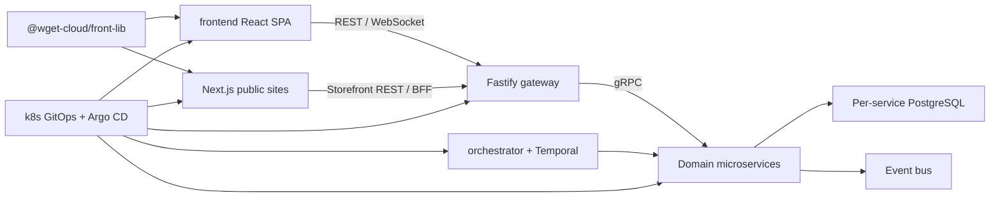

# Карта кодовой базы Wget Cloud

Проверено по рабочему дереву 2026-08-13. Эта карта ускоряет навигацию, но может устареть. В каждой задаче заново читай локальные `AGENTS.md`, package manifests, source, tests и CI. Фактически подключённый execution path, contracts/schema/config и тесты важнее описания; mock, prototype и неподключённый код нельзя выдавать за production feature.

## Содержание

- Границы репозиториев
- Сквозной runtime
- frontend
- backend
- wget-cloud-front-lib
- wget-cloud-site
- k8s
- Правила выбора владельца изменения
- Межпроектные риски

## Границы репозиториев

Корень — координационный Git repository с пятью submodules, не монорепа:

| Каталог | Назначение | Основной runtime |
| --- | --- | --- |
| `frontend/` | внутренний кабинет сотрудников | React SPA |
| `backend/` | API, домены, фоновые и межсервисные процессы | NestJS microservices + Fastify gateway |
| `wget-cloud-front-lib/` | публикуемые browser contracts/UI/runtime | ESM npm package |
| `wget-cloud-site/` | публичные клиентские PWA-витрины | Next.js/Turborepo |
| `k8s/` | desired state кластеров и приложений | Argo CD + Helm + Kubernetes |

Перед любой работой отдельно выполни для каждого затронутого проекта:

```bash
git -C <project> status -sb
git -C <project> remote -v
git -C <project> branch -vv
```

Submodule может быть detached; parent status `M/m/?` не объясняет природу изменений. Сначала проверяй внутренний repository. Коммиты разных repositories всегда отдельные; root gitlink — последним.

## Сквозной runtime

Внутренний кабинет и публичные сайты обращаются к REST/WebSocket gateway. Gateway применяет auth/guards/tenant/RBAC/transport policy и вызывает backend microservices по gRPC. Сервисы владеют отдельными PostgreSQL/Prisma boundaries. Долгие межсервисные процессы координируются Temporal workflows в `orchestrator`; события проходят через event bus. Общие browser types/site blocks/widget primitives приходят из `@wget-cloud/front-lib`. Images и runtime config доставляются через `k8s` desired state, Argo CD и Helm.



## `frontend/`

### Стек и запуск

- React 18, TypeScript 5.7, Vite 6, MUI 6.
- Redux Toolkit/RTK Query — основной server-state path; в legacy областях встречаются SWR, Axios и direct `fetch`.
- React Hook Form + Zod, React Router, Socket.IO, i18n, Workbox/Vite PWA.
- Vitest; Playwright scripts/config нужно сверять с фактическим наличием specs.
- Runtime: Node 20.x, npm 10.
- Основные команды: `npm run type-check`, `npm run lint`, `npm test`, `npm run build`, применимые `npm run test:e2e`.

### Архитектура

FSD-inspired слои: `app → pages → widgets → features → entities → shared`. Это направление зависимостей, а не доказанная строгая изоляция: в tree есть legacy imports, крупные widgets и смешанные API clients. Новый код должен улучшать boundary, не копировать legacy без проверки.

`src/main.tsx` инициализирует recovery/observability/router, затем Redux/App. `app/app.tsx` собирает providers auth/settings/theme/branding/checkout/snackbar/progress/consent. Router содержит публичные forms/widgets/onboarding и защищённые product routes.

Основной API слой — `baseApi`/`injectEndpoints`. Текущая base API infrastructure включает runtime base URL, cookie/JWT auth, correlation id, idempotency для mutations, ограниченный retry, единый refresh promise и обработку auth/conflict/server failures. Не создавай новый network path без причины.

Route change требует сверить:

- фактические route sections и guards;
- primary route registry `shared/config/routes.ts`;
- legacy `app/routes/paths.ts`, если затронут;
- navigation, i18n, permissions, breadcrumbs и deep links.

Store содержит и client slices, и основной `baseApi`, и несколько isolated APIs. Realtime change должен согласовать cache invalidation/update, reconnect и duplicate events. PWA/runtime-config change должен учитывать существующие policies: runtime config не кэшируется; API и static assets имеют разные стратегии.

### Продуктовые области и зрелость

Production-oriented области включают auth/company/RBAC, clients/leads/deals, rental/service orders, tasks, analytics, knowledge, telephony, CRM forms/widgets. В tree также есть mock/partial/prototype области — finance/wallet/invoices/jobs/automations/workdesk и legacy widgets; website builder publication требует особой проверки. Всегда прослеживай backend call и runtime wiring.

### Обязательные правила

- Прочитай `frontend/AGENTS.md`, `README.md`, `BUSINESS_LOGIC.md`, `ARCHITECTURE.md`.
- Новый authenticated server state — через принятую RTK Query infrastructure, если локальная область не доказывает иной owner.
- UI должен явно обрабатывать loading, empty, error, forbidden, offline/conflict; проверить responsive, keyboard/a11y и ru/en.
- Общий браузерный contract/hook/component сначала оцени на размещение во front-lib.
- Не описывай mock UI как production functionality.

## `backend/`

### Стек и запуск

- NestJS 11, TypeScript, Fastify gateway.
- gRPC/Protobuf с Buf/ts-proto generated clients.
- Prisma 6 + отдельные PostgreSQL boundaries сервисов.
- CQRS, domain events, shared kernel, Temporal 1.21, event bus.
- OpenTelemetry/metrics/logging; Jest 30.
- npm workspaces, Node 24+, npm 11+.
- Основные команды зависят от сервиса: `npm test`, coverage target, `npm run build`, `npm run proto:gen`, `npm run prisma:generate`, `npm run dev:<service>`, `npm run worker:<service>`.

### Структура сервиса

Типичный runtime service:

```text
services/<name>/
  src/
    main.ts
    worker.ts              # только если сервис имеет worker role
    app.module.ts
    core/
      domain/
      application/
      infrastructure/
    interfaces/
      grpc/
      http/                # где применимо
      health/
      metrics/
  prisma/
  test / *.spec.ts
  README.md
  BUSINESS_LOGIC.md
  ARCHITECTURE.md
```

Domain содержит aggregates/value objects/domain rules/events. Application — use cases, commands/queries, ports и orchestration внутри домена. Infrastructure — Prisma/external adapters. Interfaces — transport mapping. Nest module явно связывает ports/adapters, CQRS, event bus, gRPC clients и Temporal activities.

Gateway — transport boundary без собственной доменной БД: Fastify, REST/WebSocket modules, guards, validation, error mapping, tenant/company context, RBAC audit, Swagger и graceful shutdown. Не переносить в gateway бизнес-правила.

### Сервисы

Актуальные области включают:

- вход и tenancy: `gateway`, `auth`, `users`, `company`, `rbac`;
- CRM и работа: `clients`, `crm`, `tasks`, `schedule`, `specialists`;
- commerce/content: `catalog`, `marketing`, `storefront`, `website`;
- communication/files: `uploads`, `documents`, `document-renderer`, `knowledge`, `messaging`, `mailbox`, `notification`, `telephony`, `integrations`;
- finance: `billing`, `wallet`; `payments` присутствует как неполная область и не должен считаться готовым runtime service без повторной проверки;
- platform: `analytics`, `workflow`, `orchestrator`, `observability-query`, `demo`.

`backend/libs/` владеет gRPC contracts/generated clients, shared kernel, event bus, Temporal integration, observability и seed constants. Protobuf source находится под `backend/libs/grpc/proto/<service>/v1/` и требует regeneration/consumer checks.

### Orchestrator boundary

Все межсервисные и долгоживущие workflows принадлежат `services/orchestrator/src/core/application/workflows`. В текущем tree есть registration/provisioning/demo/invite/onboarding, domain events, marketing schedules, reminders, billing, reservation TTL, CRM batch/recalculation/SLA, telephony health/FCR процессы. Worker доменного сервиса реализует activities, но не владеет cross-service workflow.

### Тесты и документация

Backend имеет большую Jest test base и policy покрытия изменённого поведения; общий целевой coverage — свыше 90%, но важнее изменённые critical branches. Service test tsconfig включает тесты, build config их исключает. После каждой production правки сразу проверь существующие tests, error/security/tenant paths и coverage.

Прочитай `backend/AGENTS.md`, root docs и README/BUSINESS_LOGIC/ARCHITECTURE каждого затронутого сервиса. Code/proto/Prisma/config/tests — source of truth при расхождении docs.

## `wget-cloud-front-lib/`

### Назначение и стек

Публикуемый ESM package `@wget-cloud/front-lib`: TypeScript/React, Vite preserve-modules/DTS, React/MUI/Emotion peers, Zod, TanStack Query, Luxon и browser UI dependencies. Runtime Node 20+, npm 10.

Основные зоны:

- `domain-types` — общие browser domain contracts;
- `shared-lib` — API client, hooks, PWA, analytics, types, utils;
- `shared-ui` — UI/layout primitives;
- `site-blocks` — registry, schemas, defaults, migrations, renderer;
- `widget-core` — Custom Elements, Shadow DOM, preview/protocol/runtime;
- `widgets` — готовые embeddable widgets.

Публичность задаётся цепочкой `source → local index → package.json exports → dist JS/d.ts → consumers`. Проверяй каждый link. В проверенном tree существовал риск: некоторые nested runtime exports имели declarations, но отсутствующий JS, а site применял pnpm patch для `shared-lib/api`. Перед изменением заново проверь build output и consumer patch.

### Contract discipline

- Изменение public export/type/protocol — контрактное: SemVer/release plan, backward compatibility, оба consumers и документация.
- Не помещай app routing/store/business-specific code в библиотеку.
- Storefront server key разрешён только в server/BFF boundary.
- Site blocks проходят defaults → persisted schemaVersion → migration → Zod parse → responsive/visibility → renderer. Version bump без реальной migration может потерять данные.
- Widget runtime использует Custom Elements + Shadow DOM/React/Emotion; preview origin/message security требует явной проверки.
- StorefrontClient и widget submission имеют разные retry/idempotency свойства; не предполагая равенство, проверь фактическую реализацию.

### Проверки

Прочитай `AGENTS.md`, `README.md`, `BUSINESS_LOGIC.md`, `ARCHITECTURE.md`. В проверенной версии не было полноценных local test/lint scripts, поэтому обязательны `npm run typecheck`, `npm run build`, pack/export inspection и проверки обоих consumers. Отсутствие тестов — risk/gap, а не причина объявить изменение проверенным.

## `wget-cloud-site/`

### Стек и структура

Turborepo/pnpm 9 для многосайтовых Next.js 15 PWA. Текущий фактический сайт — `sites/demo-rental`, React 19, TypeScript, MUI 7, Auth.js v5 beta, Zustand 5, TanStack Query, Serwist 9, Sentry и Vitest. Node 22.

Архитектурное направление: `app → widgets → features → shared / @wget-cloud/front-lib`; отдельного `entities` слоя нет. Server Components по умолчанию. Browser mutations и server secrets идут через same-origin BFF routes; reads — через shared data facade, выбирающий mock/API source. UI не должен импортировать mock data напрямую.

### Runtime boundaries

- `NEXT_PUBLIC_DATA_SOURCE=mock|api` требует проверки обоих режимов.
- Server-side Storefront key (`sk_`) не должен попадать в browser bundle.
- Auth.js использует JWT; partner session использует зашифрованный httpOnly cookie. Проверенный tree экспонировал access/refresh tokens в client session — считать security-risk и не расширять без отдельного анализа.
- Persisted Zustand stores имеют версии/migrations; изменение shape требует migration, а не только default.
- Serwist policies не должны кэшировать RSC/auth/mutations; catalog/static assets имеют отдельные стратегии.
- Critical mutation в mock mode не может симулировать успешный production outcome без явного demo contract.

### Routes и проверки

App Router включает catalog/booking/services/instructors, auth/account/partner и public content; BFF расположен в `/api`. Изменение должно проверять RSC/client boundary, URL/deep links, cache/revalidation, loading/error/offline и SEO/PWA при необходимости.

Обязательны `AGENTS.md`, `README.md`, `BUSINESS_LOGIC.md`, `ARCHITECTURE.md`, guard scripts, lint/type-check/test/build. Guard scripts проверяют tracked artifacts, client boundaries, отсутствие mocks в API и direct mocks в UI. Полноценный browser E2E coverage в проверенном tree ограничен — QA должен компенсировать risk-based smoke/exploration.

## `k8s/`

Kubernetes/GitOps repository не содержит отдельного `AGENTS.md`, поэтому действуют корневые правила, README, `infrastructure/k8s/docs/ARCHITECTURE.md`, фактическая profile/component/chart структура и validators.

Актуальные ключевые paths:

```text
infrastructure/k8s/
  bootstrap/
  profiles/
  gitops/clusters/
  components/
  charts/
  docs/
  scripts/
  tests/
  legacy/                  # архив, не source of truth
```

Dev profile active; production profile в проверенном tree преимущественно planned/disabled и не должен считаться готовым. Profile renderer создаёт committed generated Argo composition. Bundle sync order использует waves примерно от core/data через apps/monitoring/observability к delivery/dev-tools; prune policy различается и требует осторожности.

Application values находятся в environment components, включая backend service/worker, frontend и site. Локальные Helm charts `nest-service`, `nest-worker-service`, `next-js-service` задают runtime secret naming, probes, resources, telemetry и build artifact args. Inline secret env/envFrom запрещён conventions charts; secrets приходят через External Secrets/Vault references.

Стандартные проверки: `make gitops-render`, `make validate`, а также узкие GitOps/resource/telemetry tests. Renderer output должен быть закоммичен вместе с source change, если проект этого требует. Детали deployment — в `gitops-and-deployment.md`.

## Правила выбора владельца изменения

| Изменение | Владелец |
| --- | --- |
| Внутренний кабинет, route, feature-specific UI | `frontend` |
| Domain rule/use case/persistence конкретной области | соответствующий `backend` service |
| REST/WS transport/guard/mapping | `backend/services/gateway` |
| Межсервисный долгий процесс | `backend/services/orchestrator` + activities владельцев |
| gRPC internal contract | `backend/libs/grpc` + provider/consumers |
| Общий browser type/API primitive/site block/widget runtime | `wget-cloud-front-lib` |
| Специфичная public-site feature/route/BFF | `wget-cloud-site` |
| Image tag, runtime desired state, Helm/Argo/profile | `k8s` |
| Root submodule pointer | coordinator root, последним |

## Межпроектные риски

- **Contract drift:** proto/type/export/schema обновлён без provider или consumer.
- **Unpublished dependency:** root gitlink или consumer ссылается на локальный неопубликованный commit/package.
- **Version skew:** front-lib source и package version/build output расходятся с site/frontend.
- **Split auth semantics:** cookie/JWT/session/server-key policies различаются между frontend, site BFF и gateway.
- **Tenant/RBAC omission:** UI guard не заменяет backend enforcement; transport context не заменяет domain ownership checks.
- **Temporal ownership leak:** доменный worker становится скрытым cross-service orchestrator.
- **Mock illusion:** UI/API mock выдаётся за production readiness.
- **PWA stale behavior:** cache/store migration/runtime config не учитывает новый contract.
- **Mutable rollout:** изменяемый tag или ручное cluster state лишает GitOps воспроизводимости.
- **Premature production claim:** planned k8s profile или неполный backend service воспринимается как готовый.

Architect обязан явно проверить применимые риски, reviewer — искать их в diff, QA — проверять observable последствия, deployment agent — не скрывать остаточный риск формулировкой «багов нет».
