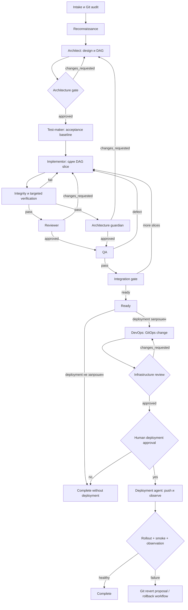

# Конвейер реализации

## Содержание

- Модель управления
- Машина состояний
- Основной поток
- Rework loops
- Параллельность
- Межрепозиторная доставка
- Остановка и эскалация

## Модель управления

Оркестратор — единственный владелец `WorkItem`, gate ledger и текущего состояния. Агент не назначает работу следующему агенту и не объявляет задачу готовой. Он возвращает ограниченный артефакт с доказательствами и verdict. Оркестратор проверяет артефакт, состояние Git и только затем выполняет переход.

Каждый запуск агента должен быть узким: одна роль, один task slice, известный input, разрешённый path scope и явное условие завершения. Контекст передаётся артефактами, а не свободным пересказом.

## Машина состояний

Допустимые состояния:

| Состояние | Требуемый вход | Допустимый выход |
| --- | --- | --- |
| `intake` | запрос пользователя | `reconnaissance`, `blocked` |
| `reconnaissance` | WorkItem draft | `design`, `blocked` |
| `design` | evidence map | `architecture_plan_review` |
| `architecture_plan_review` | ArchitecturePlan | `test_baseline`, `design`, `blocked` |
| `test_baseline` | approved plan | `implementation`, `blocked` |
| `implementation` | TestPlan/protected paths | `verification`, `blocked` |
| `verification` | diff + command evidence | `review`, `implementation`, `blocked` |
| `review` | verified diff | `qa`, `implementation`, `design`, `blocked` |
| `qa` | reviewer + architecture approvals | `integration`, `implementation`, `blocked` |
| `integration` | QA report | `implementation`, `ready`, `blocked` |
| `ready` | all application gates | `complete`, `devops`, `awaiting_deploy_approval` |
| `devops` | DeploymentPlan | `infrastructure_review` |
| `infrastructure_review` | k8s diff + validation | `devops`, `awaiting_deploy_approval`, `blocked` |
| `awaiting_deploy_approval` | exact release identity | `deployment`, `complete`, `blocked` |
| `deployment` | valid human approval | `observation`, `failed` |
| `observation` | rollout evidence | `complete`, `failed`, `rollback_proposed` |
| `rollback_proposed` | failure evidence | `deployment` только после разрешённого Git revert flow |
| `complete` | terminal evidence | — |
| `blocked` | конкретный внешний blocker | — до нового input |

Нельзя перепрыгивать gate. Повторная правка после approval делает относящиеся к diff approvals устаревшими.

## Основной поток

### 1. Intake и repository audit

Зафиксируй:

- наблюдаемое текущее поведение и желаемый outcome;
- acceptance criteria с положительными, отрицательными и permission scenarios;
- явные exclusions;
- предположительно затронутые repositories и contract boundaries;
- нужны ли data migration, feature flag, backward compatibility, observability, deployment;
- окружение, если deployment уже явно запрошен;
- branch, upstream, remote, HEAD и dirty paths каждого репозитория;
- существующие пользовательские изменения, которые нельзя присваивать или перезаписывать.

Если запрос допускает несколько существенно разных продуктовых или архитектурных решений, после безопасного исследования запроси выбор человека. Мелкую неопределённость разрешай по local conventions.

### 2. Reconnaissance

Explorer находит реальную подключённую цепочку исполнения: routes/controllers, application use case, domain invariants, ports/adapters, schema/proto, persistence, clients, state, UI, tests, CI, deployment values. Он отдельно помечает legacy, mock, prototype, dead/unwired и generated code.

Для cross-repo задачи запускай независимое исследование проектов параллельно, но оркестратор сам сверяет ключевые точки входа. Результат — evidence map с `file:line`, не общий обзор.

### 3. Design

Architect превращает acceptance criteria и evidence map в DAG. Для каждого узла укажи:

- owner repository и paths;
- инвариант и границы ответственности;
- входные/выходные contracts;
- compatibility/migration strategy;
- тесты и coverage expectations;
- documentation;
- зависимость от предыдущих узлов;
- independently reviewable completion condition.

Один узел DAG должен быть одной логической причиной изменения. Разделяй behavior, mechanical refactor, generated artifacts, infrastructure и unrelated documentation cleanup.

### 4. Architecture plan gate

Architecture guardian проверяет план относительно текущей структуры и локального стиля, не предлагая собственную реализацию вместо review. Блокирующие примеры:

- business rule помещается в transport/UI/adapter;
- межсервисный workflow помещается в доменный сервис вместо orchestrator;
- shared browser contract копируется в consumer;
- frontend создаёт новый direct fetch/Axios/SWR path вместо принятого API слоя;
- site смешивает server secret с client bundle или UI с data source;
- GitOps source оказывается не владельцем runtime state;
- public contract меняется без consumers/versioning/migration.

### 5. Test baseline

Test-maker переводит критерии приёмки в executable evidence. Он проверяет существующие тесты до добавления новых, избегает дублей и моков, которые обходят изменяемый инвариант. Обязательны релевантные happy path, regression, boundary/error paths и security/tenant cases.

Сразу после его работы оркестратор фиксирует:

- test paths;
- хеш содержимого каждого защищённого файла;
- ожидаемую failing/passing baseline;
- commands и причины ожидаемых failures;
- files, которые implementor может менять.

### 6. Implementation slices

Implementor получает ровно один готовый узел DAG. Он не расширяет scope и не редактирует защищённые тесты. После минимального связного изменения он запускает наиболее узкие tests с coverage, затем typecheck/lint/build в мере риска. Если контракт заставляет изменить тест, implementor останавливается и возвращает вопрос оркестратору; test-maker решает его независимо.

После каждого write-agent оркестратор проверяет:

1. `git status -sb` и diff именно нужного repo.
2. Нет ли новых изменений за пределами allowlist.
3. Совпадают ли хеши protected tests.
4. Не смешаны ли пользовательские dirty files.
5. Соответствуют ли результаты команд фактическому tree.

### 7. Independent review

Reviewer проверяет корректность, безопасность, regressions и адекватность тестов. Architecture guardian отдельно проверяет placement, dependency direction, boundaries, public API discipline и стиль проекта. Одобрение одного не заменяет другое.

Если diff стабилен, два read-only review можно делать параллельно. После любой правки оба approval, затронутые этой правкой, сбрасываются.

### 8. QA и integration

QA работает только после reviewer approval и post-implementation architecture approval. Он исследует поведение как внешний пользователь/интеграция и пытается найти недоказанные failure modes. Найденный product defect возвращается implementor; ошибочный/неполный тест — test-maker; архитектурная причина — architect, затем implementor.

Integration gate выполняет оркестратор:

- все DAG nodes завершены в dependency order;
- contracts/schema/generated code согласованы;
- потребители проверены;
- docs описывают только реально подключённое поведение;
- расширенные repo-specific checks пройдены;
- commit plan атомарен, даже если commits ещё не разрешены;
- deployment input содержит точные immutable release identifiers.

## Rework loops

| Источник проблемы | Кому вернуть | Какие gates повторить |
| --- | --- | --- |
| Test baseline неверен | test-maker | test baseline → implementation verification → reviews → QA |
| Реализация неверна | implementor | verification → reviewer → architecture guardian при структурном diff → QA |
| План нарушает архитектуру | architect | architecture plan review → test baseline и всё ниже |
| Готовый diff нарушает архитектуру | architect + implementor | architecture plan review для изменённой части → implementation → оба reviews → QA |
| QA product defect | implementor | verification → reviews → QA |
| QA test defect | test-maker | protected baseline → implementation verification → reviews → QA |
| GitOps diff неверен | DevOps | infrastructure review → human gate |
| Rollout failure | deployment agent диагностирует; автор исправляет | полный применимый code/infra цикл, новый approval |

Не закрывай finding устным обещанием. Нужны новый diff и evidence.

## Параллельность

Разрешено:

- read-only explorers по разным проектам;
- reviewer и architecture guardian по одному неизменяемому diff;
- независимые test-maker tasks по разным repositories;
- независимые implementors только по разным repositories и без общего contract owner;
- application QA и подготовительное read-only deployment reconnaissance.

Запрещено:

- test-maker и implementor одновременно в одном path scope;
- два write-агента в одном repository;
- consumer implementation до стабилизации contract owner, если нет backward-compatible staged plan;
- DevOps и infrastructure reviewer писать одновременно;
- review или QA по diff, который продолжает изменяться;
- deployment до immutable release identity и human gate.

## Межрепозиторная доставка

Типичный contract-first порядок:

1. Backward-compatible source-of-truth contract/schema/proto.
2. Generated artifacts и минимальный provider implementation.
3. Shared library public export/version, если нужен браузерный контракт.
4. Consumers (`frontend`, `wget-cloud-site`) отдельными changesets.
5. GitOps desired state с immutable images/config.
6. Корневой coordinator gitlink — последним и только на опубликованные submodule commits.

Это не универсальный порядок: architect обязан обосновать DAG. Каждый repository имеет отдельный commit и собственные проверки. Нельзя создавать root commit, указывающий на недоступный локальный submodule commit.

## Остановка и эскалация

Остановись и запроси человека, если:

- требуется выбрать продуктовую семантику или несовместимую migration strategy;
- dirty/diverged branch пересекается с нужным scope и безопасно отделить изменения нельзя;
- нужен secret, external authority, production access или destructive action;
- требуется commit/push/PR/merge/release/deployment без явного разрешения;
- approval относится к другому commit/environment/image;
- критичная проверка недоступна и альтернативное доказательство недостаточно.

`blocked` должен содержать конкретный blocker, уже выполненные безопасные проверки и минимальный следующий input. Трудность или длительность сами по себе не blocker.
